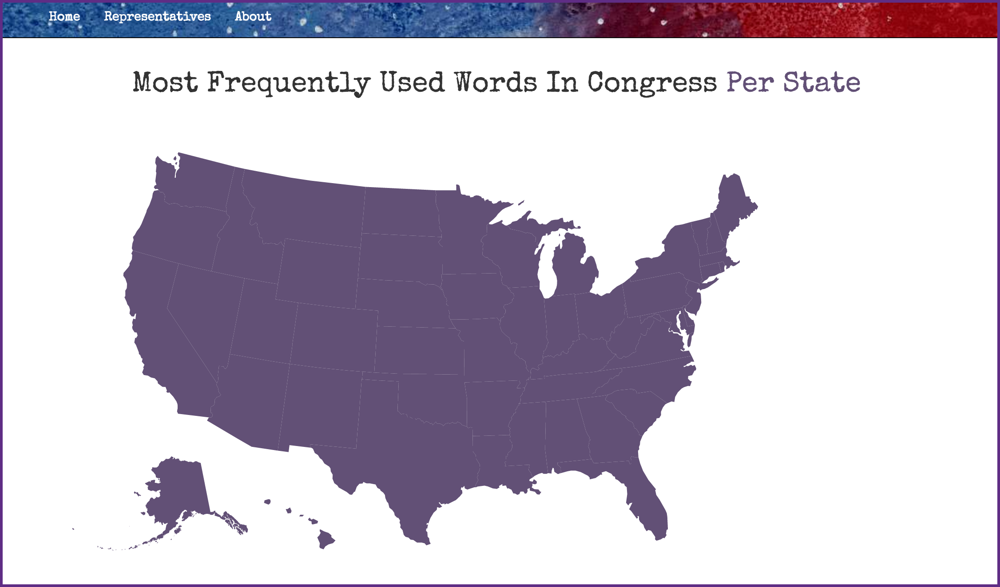
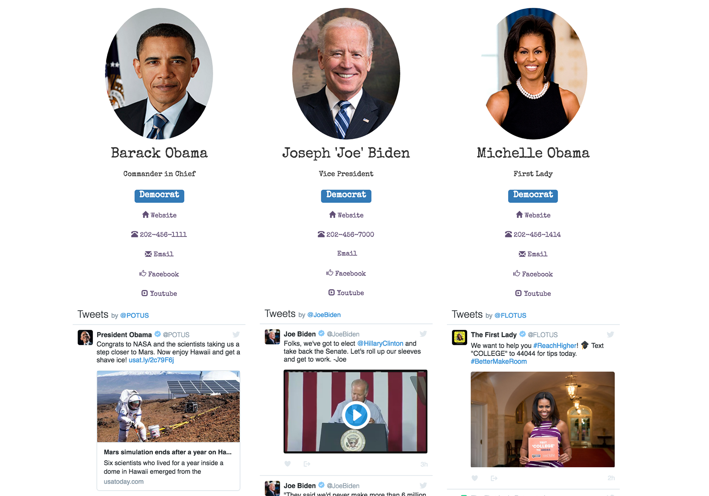
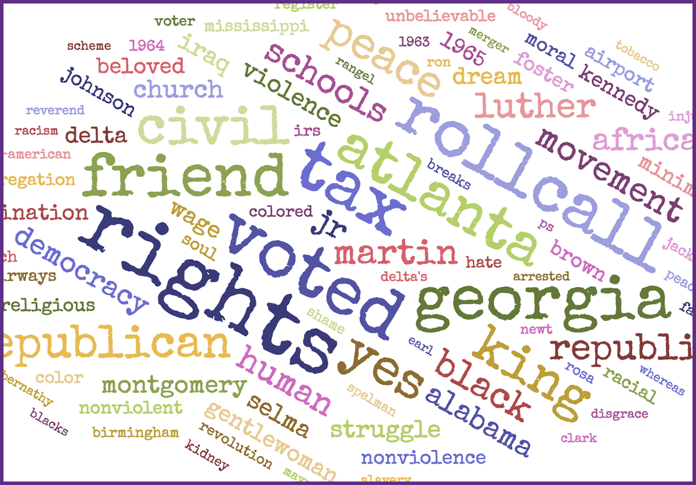

## Table of Contents

* [About](#about)
* [Technologies](#tech)
* [Development](#dev)
* [User Experience](#user)
* [Run Locally](#run)
* [Author](#author)

## About
#### Hackbright Project - Summer 2016

Peek behind the curtain and get to know your Representatives. Do their social media rants line up with their focus at the state level or on the hill? Assess their platform and hold them to their word by visualizing and considering the words they use each day while in session.

Check out the most popular words spoken by legislators of a chosen state, gaining insight into the way in which lawmakers shape and are shaped by their constituents. Users can search for contact information and social details of their federal, state, and local Representatives.

## Technologies

[Python 2.7](https://www.python.org/ "Python")    | [Javascript](https://www.python.org/ "Javascript")    | **[Capitol Words API](http://sunlightlabs.github.io/Capitol-Words/ "Sunlight: Capitol Words")**
:----------- | :-----------: | -----------:
**[Flask](http://flask.pocoo.org/ "Flask")**           | **[jQuery](https://jquery.com/ "jQuery")**           | **[Sunlight: Congress API](https://sunlightlabs.github.io/congress/ "Sunlight: Congress")**
**[SQLAlchemy](http://www.sqlalchemy.org/ "SQLAlchemy")**           | **[Bootstrap](http://getbootstrap.com/ "Bootstrap")**           | **[Open States API](http://sunlightlabs.github.io/openstates-api/ "Sunlight: Open States")**
**[AJAX / JSON](https://api.jquery.com/category/ajax/ "AJAX")**           | **[CSS](https://developer.mozilla.org/en-US/docs/Web/CSS "CSS")**           | **[Google Maps API](https://developers.google.com/maps/ "Google Maps")**
**[D3](https://d3js.org/ "D3")**           | **[Jinja2](http://jinja.pocoo.org/ "Jinja2")**           | **[Twitter API](https://dev.twitter.com/ "Twitter")**

**Dependencies:** [requirements.txt](README.md "Dependencies")

**Test Coverage:** [90% unittest coverage](tests.py)

## Development

*Excited to have an opportunity to learn based on some of my own interests, this app is front-end heavy with use of amazing API data integrated into visuals including an interactive D3 map and word clouds.*

The SVG map is composed of paths created with coordinates via JSON. Map interactivity is programmed with a combination of D3, Javascript, jQuery, and AJAX. Each evening, the Congressional Record is parsed and marked up by the [Sunlight Foundation](http://sunlightfoundation.com/ "Sunlight Foundation"). Their Capitol Words API provides access to the incoming data we see once jsonified, weighed, and put in descending order.

When querying Representative details, a Flask post request provides the location, giving Python access to use the Google Maps API and geocoder to obtain a generalized latitude, longitude set for the given city. This is used to query Congress API results at the same time as the Open States API. The JSON is then parsed and looped through with Javascript and Jinja2 on the front-end, finally being fed into the bootstrap framework.

Once Representative details are received, design elements transform them by image sizing and stylization, adding party specific tag colors, descriptors, and 'click to call' options. The twitter handle is provided for the Twitter API in order to render the live stream directly under each person.

The 'My Words' button prompts the use of jQuery and AJAX to procure a unique identifier for the given Representative. Python is then able to query the Capitol Words API for the most popularly used words by that given Representative. Python orders the words by weight and adds them to an array of sets, passing this to the D3 javascript on the front-end. A D3 word cloud is then stylized and rendered with this data.

### Progression Timeline

* Setup vagrant, environment, file tree
* Develop raw layout specs and Flask routes
* Sunlight API doc review and Python test queries
* SQL database modeling and population
* Establish Google Maps API and geolocating input fields
* Construct Congress API and OpenStates API queries

Code review and commenting assessment

* Add minimal Bootstrap layout and base structure
* Ensure JSON parsing into Jinja2
* Decide on contact details and test Twitter API
* Stylize and organize incoming data
* Create Federal profile structures

Code review and commenting assessment

* D3 research: US map and Wordcloud
* Add SVG JSON paths for US map
* Containerize and produce map
* Query data from Capitol Words API
* Use Python to formulate jsonified data
* Bind JSON data to map paths with highlight feature

Code review and commenting assessment

* Actualize jQuery and AJAX for Capitol Words displays
* Organize jsonified API data with Python
* Calibrate D3 word cloud and bind to data
* Finalize stylization and front-end visual elements
* Review CSS and profile layouts

Code review and demo practice

* Produce unit tests to minimum threshold of 85%
* Create about section for app
* Develop README
* Access wish list for additional features (given time)

## User Experience
### Popular Words by State Representatives

#### Who Represents You - Popular Words by Utah Representatives:
For each state, you can visualize the Congressional Record in relation to the state legislators. Click on a state and view their most frequently used words. This provides a quick overview of the issues being addressed by that states Representatives on the Senate and House floors.

#### Who Represents You - Representative Details:
Enter a city and select a state: view image, party affiliation, and details about each local, state, and federal Representative. Visit their website, call their office with a single click, check out to their social media accounts, and interact with their Twitter feed directly from this app.

#### Who Represents You - Representative Words:
Click on the button, 'My Words' and find out what each of these state Representatives are talking about in Congress and Senate. This gives a visual birds eye view of their commentary and verbal representation. Peruse their Twitter feed to gather a sense of drive and actions that are in relation to these.

## Run Locally
### Flask App

Create a local directory to work within

	$ mkdir -p YOUR_DIRECTORY_NAME_HERE

Clone this repository and cd into it
	
	$ git clone https://github.com/aroseartist/Who-Represents-You YOUR_DIRECTORY_NAME_HERE
	
	$ cd ~/YOUR_DIRECTORY_NAME_HERE

Create your python [virtualenv](http://docs.python-guide.org/en/latest/dev/virtualenvs/ "VirtualEnv") and activate it

	$ virtualenv env
	
	$ source env/bin/activate

Install the required Python packages & dependencies
	
	$ pip install -r requirements.txt

Visit the [API](#api) locations and get a secret_key for each.

Create a secrets.sh file

	$ touch secrets.sh YOUR_DIRECTORY_NAME_HERE

Open and add (or simply CAT on the command line) your secret keys into secrets.sh

	export SUNLIGHT_API_KEY = "REPLACE_WITH_YOUR_KEY"  
	export GEOLOCATE_GOOGLE_API = "REPLACE_WITH_YOUR_KEY"  
	export GOOGLE_API_KEY = "REPLACE_WITH_YOUR_KEY"  
	export TWITTER_SECRET_API_KEY = "REPLACE_WITH_YOUR_KEY"  
	export TWITTER_SECRET_ACCESS_API_KEY = "REPLACE_WITH_YOUR_KEY"

Give your app access to this file

	$ source secrets.sh

In your command line, start up the flask server
	
	$ python server.py
	
In your borwser, go to localhost:5000 to see the web app

## Author

Lora "Ro" Rose is a software engineer from San Francisco, CA with a background in data and analytics program development. After obtaining a Master of Science in Marketing with a concentration in New Media, she has persued software engineering as a route towards a career in data visualization. Visit her online:

[Personal Website](http://www.aroseartist.com/ "ARoseArtist")

[LinkedIn](linkedin.com/in/aroseartist "Lora Rose")

